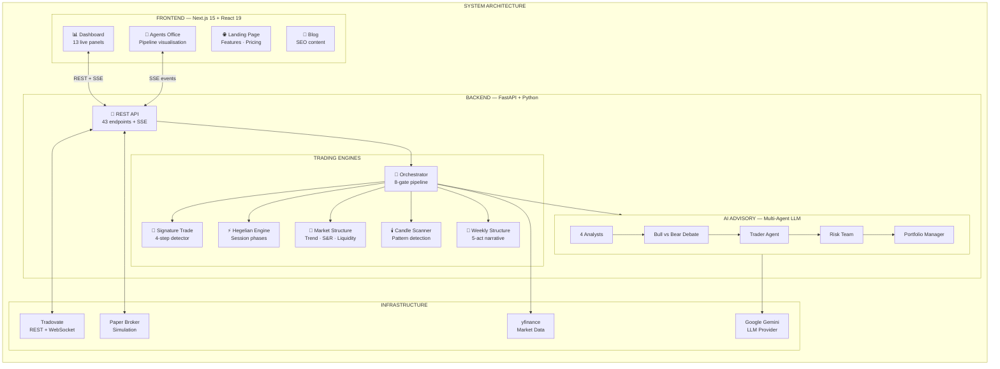
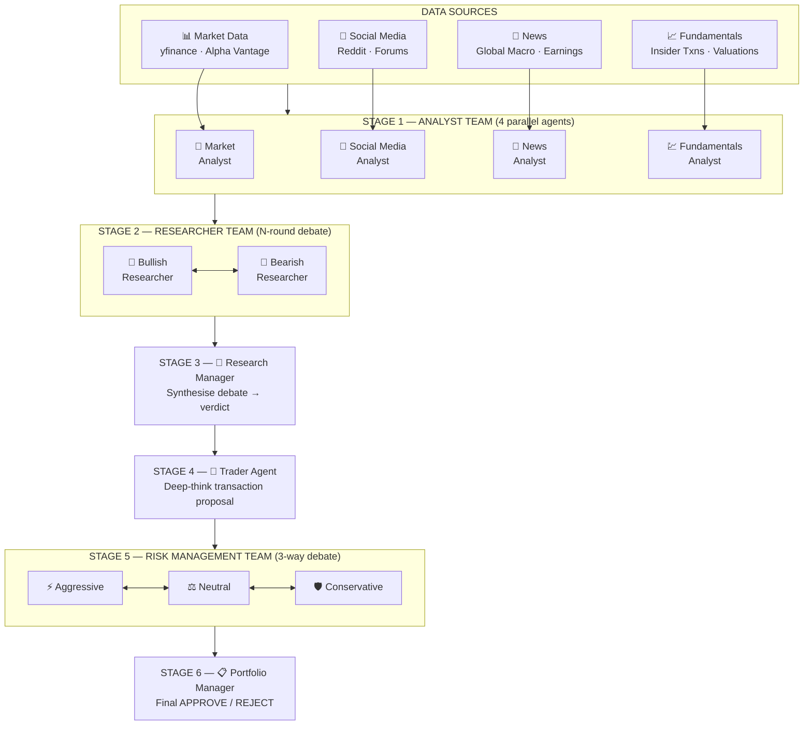
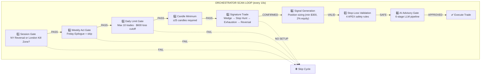
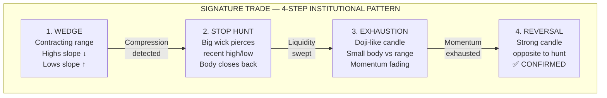
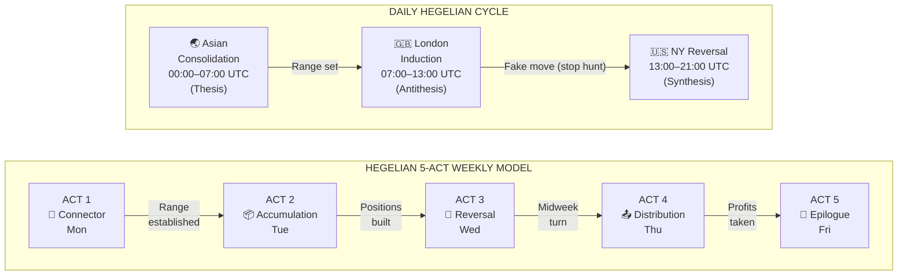

<div align="center">

# NQ-Trading Agents

### Institutional-Grade Autonomous Trading System for Nasdaq-100 Futures

**Multi-Agent LLM Pipeline &bull; FOREXIA Smart Money Methodology &bull; APEX 100K Compliant**

[](https://python.org)
[](https://fastapi.tiangolo.com)
[](https://nextjs.org)
[](https://react.dev)
[](https://typescriptlang.org)
[](https://tailwindcss.com)
[](https://langchain.com)
[](LICENSE)

---

**NQ-Trading Agents** is an autonomous trading system that combines **ICT Smart Money Concepts** with a **6-stage multi-agent LLM pipeline** to detect, validate, and execute institutional-grade trade setups on MNQ (Micro E-mini Nasdaq-100) futures. Built for **APEX 100K** funded accounts with strict risk management hardcoded at every layer.

[Features](#-features) &bull; [Architecture](#-system-architecture) &bull; [Quick Start](#-quick-start) &bull; [Configuration](#%EF%B8%8F-configuration) &bull; [API Reference](#-api-reference) &bull; [About Me](#-about-me) &bull; [Contact](#-contact)

</div>

---

## 🧠 How It Works

Every **10 seconds**, the Orchestrator runs a scan cycle through an **8-gate pipeline**. A signal must pass **every gate** before a trade is placed:

```
Session Gate → Weekly Act Gate → Daily Limit Gate → Candle Minimum →
Signature Trade Detection → Signal Generation → Stop-Loss Validation → AI Advisory Gate → ✅ Execute
```

The AI Advisory Gate runs a full **6-stage multi-agent debate** using Google Gemini — 4 analysts produce reports, researchers argue bull vs bear, a trader proposes the transaction, a risk team debates exposure, and a portfolio manager makes the final APPROVE/REJECT decision.

---

## ✨ Features

| Feature | Description |
|---------|-------------|
| **🎯 Signature Trade Detection** | 4-step institutional pattern recognition: Wedge → Stop Hunt → Exhaustion → Reversal |
| **🤖 6-Stage AI Advisory Pipeline** | 12 specialized LLM agents validate every signal through debate, analysis, and risk assessment |
| **⚡ Hegelian Session Model** | Maps Asian (Thesis) → London (Antithesis) → NY (Synthesis) for optimal timing |
| **📅 5-Act Weekly Structure** | Connector → Accumulation → Reversal → Distribution → Epilogue narrative tracking |
| **🛡️ APEX 100K Risk Engine** | $300 max risk/trade, 2% equity cap, 4 MNQ limit, $600 daily loss cutoff, $3K trailing drawdown |
| **📊 Real-Time Dashboard** | 13 live panels — chart, positions, orders, fills, liquidity, market structure, session phase |
| **🤖 Agents Office** | Real-time pipeline visualization — watch each AI agent light up as it processes via SSE |
| **🔌 Tradovate Integration** | Full REST + WebSocket — bracket orders, auto-auth, front-month contract discovery |
| **📝 SEO Blog Engine** | LLM-powered article generation with keyword targeting |
| **🧪 Paper Trading Mode** | Zero-risk simulation when Tradovate credentials are absent |

---

## 🏗️ System Architecture



---

### 6-Stage Multi-Agent AI Pipeline

The core intelligence layer. Every trade signal passes through **12 specialized LLM agents** organized in 6 stages:



| Stage | Agents | Purpose |
|-------|--------|---------|
| **1. Analyst Team** | Market, Social Media, News, Fundamentals | 4 parallel analysts produce independent reports |
| **2. Researcher Team** | Bullish Researcher, Bearish Researcher | N-round structured debate → Buy Evidence + Sell Evidence |
| **3. Research Manager** | Research Manager | Synthesizes the debate into a directional verdict |
| **4. Trader Agent** | Trader (deep-think) | Produces a concrete transaction proposal with entry, SL, TP |
| **5. Risk Management** | Aggressive, Neutral, Conservative | 3-way debate on position sizing and risk exposure |
| **6. Portfolio Manager** | Portfolio Manager | Final APPROVE / REJECT with confidence score |

---

### Orchestrator 8-Gate Pipeline



---

### Signature Trade Detection

The proprietary 4-step institutional pattern recognition engine:



---

### Hegelian Weekly + Daily Model



---

## 🚀 Quick Start

### Prerequisites

- **Python 3.11+**
- **Node.js 18+**
- **Google Gemini API Key** (for AI Advisory)

### 1. Clone & Install

```bash
git clone https://github.com/yourusername/NQ-Trading-Agents.git
cd NQ-Trading-Agents
```

### 2. Backend Setup

```bash
cd backend
python -m venv ../.venv
source ../.venv/bin/activate    # macOS/Linux
pip install -e .
```

### 3. Environment Variables

Create a `.env` file in the project root:

```env
# ── LLM Provider (required for AI Advisory) ──
GOOGLE_API_KEY=your_gemini_api_key

# ── Tradovate (optional — omit for paper trading mode) ──
TRADOVATE_USERNAME=your_username
TRADOVATE_PASSWORD=your_password
TRADOVATE_APP_ID=your_app_id
TRADOVATE_APP_VERSION=1.0
TRADOVATE_CID=your_client_id          # optional
TRADOVATE_SEC=your_client_secret       # optional
TRADOVATE_ACCOUNT_SPEC=your_account    # optional

# ── Market Data (optional enrichment) ──
ALPHA_VANTAGE_API_KEY=your_key
```

### 4. Start Backend

```bash
python -m nq_trading_agents.server
# → http://localhost:8000
# → Health check: http://localhost:8000/health
```

### 5. Frontend Setup

```bash
cd frontend
npm install
npm run dev
# → http://localhost:3000
```

### 6. Open the Dashboard

| Page | URL | Description |
|------|-----|-------------|
| **Landing** | `http://localhost:3000` | Features, pricing, overview |
| **Dashboard** | `http://localhost:3000/dashboard` | Live trading panels |
| **Agents Office** | `http://localhost:3000/agents-office` | AI pipeline visualization |

---

## ⚙️ Configuration

All risk management parameters are hardcoded in `config.py` to enforce APEX 100K compliance:

| Parameter | Value | Description |
|-----------|-------|-------------|
| Account Size | $100,000 | APEX 100K evaluation account |
| Trailing Drawdown | $3,000 | Maximum trailing drawdown |
| Max Risk/Trade | min(2% equity, $300) | Position sizing cap |
| Max Contracts | 4 MNQ | Per-trade contract limit |
| Max SL Distance | 20 NQ points | Stop-loss distance cap |
| Daily Loss Limit | $600 | Stops trading after hit |
| Max Trades/Day | 10 | Daily trade frequency limit |
| Scan Interval | 10 seconds | How often the orchestrator scans |
| Intraday Close | 21:00 UTC | All positions closed |
| Kill Zones | London 08–12 UTC, NY 14–16 UTC | High-probability windows |
| LLM Provider | Google Gemini 2.0 Flash | Multi-agent pipeline model |
| Debate Rounds | 1 | Speed-optimized for intraday |

---

## 📡 API Reference

**43 endpoints** organized by domain:

<details>
<summary><strong>📊 Dashboard & Health</strong></summary>

| Method | Endpoint | Description |
|--------|----------|-------------|
| GET | `/health` | System health + broker status |
| GET | `/api/dashboard` | Full dashboard state |
| GET | `/api/status` | Bot operational status |

</details>

<details>
<summary><strong>💰 Account & Positions</strong></summary>

| Method | Endpoint | Description |
|--------|----------|-------------|
| GET | `/api/account` | Account balance & equity |
| GET | `/api/account/raw` | Raw Tradovate account data |
| GET | `/api/positions` | Open positions |
| GET | `/api/orders` | Active orders |
| GET | `/api/fills` | Recent fills |
| GET | `/api/quote` | Live NQ quote |

</details>

<details>
<summary><strong>📈 Market Data & Charts</strong></summary>

| Method | Endpoint | Description |
|--------|----------|-------------|
| GET | `/api/candles` | OHLCV candle data |
| POST | `/api/timeframe` | Change chart timeframe |
| GET | `/api/contract` | Front-month NQ contract |
| GET | `/api/contracts/suggest` | Contract suggestions |
| GET | `/api/session` | Current session phase |
| GET | `/api/weekly-act` | Weekly structure act |
| GET | `/api/signals` | Active signals |
| GET | `/api/liquidity` | Liquidity zones |
| GET | `/api/market-structure` | Trend & structure data |
| GET | `/api/trades` | Trade history |

</details>

<details>
<summary><strong>🤖 Bot Control</strong></summary>

| Method | Endpoint | Description |
|--------|----------|-------------|
| POST | `/api/bot/scan` | Trigger manual scan |
| GET | `/api/bot/diagnostics` | System diagnostics |
| GET | `/api/bot/scan-diagnostic` | Last scan breakdown |
| POST | `/api/bot/auto-trade/start` | Start auto-trading |
| POST | `/api/bot/auto-trade/stop` | Stop auto-trading |
| GET | `/api/bot/auto-trade/status` | Auto-trade state |

</details>

<details>
<summary><strong>📋 Orders</strong></summary>

| Method | Endpoint | Description |
|--------|----------|-------------|
| POST | `/api/order/market` | Place market order |
| POST | `/api/order/bracket` | Place bracket order (entry + SL + TP) |
| POST | `/api/order/cancel` | Cancel order |
| POST | `/api/order/liquidate` | Liquidate position |
| POST | `/api/order/close-all` | Close all positions |

</details>

<details>
<summary><strong>🧠 AI Advisory</strong></summary>

| Method | Endpoint | Description |
|--------|----------|-------------|
| GET | `/api/ai-advisory` | Advisory status & last result |
| POST | `/api/ai-advisory/toggle` | Enable/disable AI gate |
| GET | `/api/ai-advisory/memory` | AI learning memory |
| GET | `/api/agents/events` | **SSE** — real-time pipeline events |
| GET | `/api/agents/history` | Pipeline event history |

</details>

<details>
<summary><strong>⚙️ Settings & Connection</strong></summary>

| Method | Endpoint | Description |
|--------|----------|-------------|
| GET | `/api/settings/saved-credentials` | Check stored credentials |
| POST | `/api/settings/connect` | Connect to Tradovate |
| POST | `/api/settings/browser-login` | Browser-based Tradovate auth |
| POST | `/api/settings/connect-token` | Connect with existing token |
| POST | `/api/settings/disconnect` | Disconnect broker |

</details>

---

## 📁 Project Structure

```
NQ-Trading-Agents/
├── backend/
│   ├── pyproject.toml
│   └── src/
│       └── nq_trading_agents/
│           ├── config.py                 # Master APEX/risk configuration
│           ├── orchestrator.py           # Central 8-gate scan pipeline
│           ├── server.py                 # FastAPI — 43 endpoints + SSE
│           ├── application/
│           │   └── ports/
│           │       └── broker_port.py    # Broker interface (hexagonal port)
│           ├── domain/
│           │   ├── entities/
│           │   │   └── trade.py          # Trade domain entity
│           │   └── services/             # Domain services
│           ├── engines/
│           │   ├── agent_prompts.py      # 12 specialized agent prompts
│           │   ├── ai_advisory.py        # 6-stage multi-agent LLM pipeline
│           │   ├── candle_scanner.py     # Candlestick pattern detection
│           │   ├── data_adapter.py       # Internal data → LLM text bridge
│           │   ├── external_data.py      # News, sentiment, macro fetcher
│           │   ├── hegelian_engine.py    # Session phase + kill zone engine
│           │   ├── market_structure.py   # Trend, S&R, liquidity analysis
│           │   ├── signature_trade.py    # 4-step institutional pattern FSM
│           │   └── weekly_structure.py   # 5-act weekly narrative model
│           ├── infrastructure/
│           │   └── brokers/
│           │       ├── paper_broker.py       # Paper trading simulation
│           │       ├── tradovate_broker.py   # Full Tradovate REST + WS
│           │       └── browser_auth.py       # Browser-based auth flow
│           └── models/
│               └── schemas.py            # Pydantic schemas & enums
├── frontend/
│   ├── package.json
│   └── src/
│       ├── app/
│       │   ├── page.tsx              # Landing page
│       │   ├── dashboard/page.tsx    # Live trading dashboard
│       │   ├── agents-office/page.tsx # AI pipeline visualization
│       │   ├── blog/                 # SEO blog pages
│       │   ├── login/page.tsx
│       │   └── register/page.tsx
│       ├── components/trading/
│       │   ├── NQ100Chart.tsx        # TradingView-style chart
│       │   ├── AccountPanel.tsx      # Balance & equity
│       │   ├── PositionsPanel.tsx    # Open positions
│       │   ├── OrderPanel.tsx        # Order entry
│       │   ├── FillsPanel.tsx        # Recent fills
│       │   ├── SessionPhasePanel.tsx # Hegelian phase display
│       │   ├── WeeklyActDisplay.tsx  # Weekly structure act
│       │   ├── InductionMeter.tsx    # Induction progress meter
│       │   ├── MarketStructurePanel.tsx
│       │   ├── LiquidityPanel.tsx
│       │   ├── TradeHistory.tsx
│       │   ├── ConnectionStatus.tsx
│       │   └── SettingsPanel.tsx
│       ├── hooks/
│       │   ├── useSmartMoney.ts      # Main data hook (REST + polling)
│       │   └── useAgentEvents.ts     # SSE hook for pipeline events
│       └── lib/
│           └── types.ts              # TypeScript contracts
├── .env                              # Environment variables
├── .gitignore
└── test_orchestrator.py              # Integration tests
```

---

## 🛠️ Tech Stack

| Layer | Technology | Purpose |
|-------|-----------|---------|
| **Backend** | Python 3.11+, FastAPI, Uvicorn | REST API + SSE streaming |
| **AI/LLM** | LangChain, Google Gemini 2.0 Flash | Multi-agent advisory pipeline |
| **Market Data** | yfinance, Alpha Vantage | Price data, news, fundamentals |
| **Broker** | Tradovate REST + WebSocket | Order execution, live data |
| **Frontend** | Next.js 15, React 19, TypeScript 5.7 | Dashboard + visualization |
| **Styling** | Tailwind CSS 3.4 | Dark-mode trading UI |
| **Charts** | Lightweight Charts (TradingView) | Candlestick + overlays |
| **Communication** | SSE (Server-Sent Events) | Real-time pipeline streaming |
| **Architecture** | Hexagonal (Ports & Adapters) | Clean, testable boundaries |

---

## ⚠️ Disclaimer

This software is provided for **educational and research purposes only**. Trading futures involves substantial risk of loss and is not suitable for all investors. Past performance is not indicative of future results. The authors are not responsible for any financial losses incurred through the use of this software.

**This is not financial advice.** Always trade with money you can afford to lose.

---

## 👨‍💻 About Me

**Full-Stack Developer & AI/Fintech Engineer**

I specialize in building **production-grade autonomous systems** at the intersection of artificial intelligence, financial technology, and real-time distributed architectures. My work spans:

- **🤖 AI & Multi-Agent Systems** — Designing LLM-powered pipelines with structured debate, adversarial validation, and autonomous decision-making using LangChain, LangGraph, and multi-provider architectures (OpenAI, Anthropic, Google Gemini).

- **📊 Algorithmic Trading & Fintech** — End-to-end trading systems: market microstructure analysis, institutional pattern detection (ICT/Smart Money), risk management engines, and broker API integrations (Tradovate, Interactive Brokers).

- **⚡ Full-Stack Real-Time Applications** — High-performance backends (Python/FastAPI, Node.js) with WebSocket/SSE streaming, connected to modern React frontends (Next.js, TypeScript, Tailwind CSS).

- **🏗️ Clean Architecture & Systems Design** — Hexagonal architecture, domain-driven design, event-driven systems, and microservice patterns. Code that scales and stays maintainable.

- **☁️ Cloud & DevOps** — AWS, Docker, CI/CD pipelines, infrastructure as code. From prototype to production.

I believe great software comes from **deep domain understanding** combined with **disciplined engineering**. Every system I build is designed to be production-ready from day one — no shortcuts on risk management, no compromises on code quality.

---

## 📬 Contact

I'm always open to collaboration on **AI systems**, **trading technology**, or **full-stack development** projects.

| Channel | Link |
|---------|------|
| **Telegram** | [@fabrimattei_dcc](https://t.me/fabrimattei_dcc) |
| **Email** | fabrizio.mattei@decentralchain.io |

> 💡 **Open to freelance projects, consulting, and full-time opportunities in AI/Fintech.**

---

<div align="center">

**Built with precision. Engineered for institutions.**

Made with ☕ and discipline.

</div>
